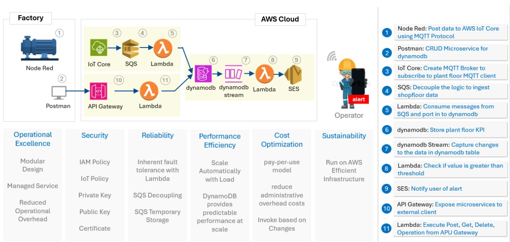

# Capstone Project : Internet Of Things

## Overview




This architecture implements a comprehensive factory monitoring system using AWS serverless technologies to collect, process, store, and analyse plant floor data from IoT devices. The system provides real-time monitoring, alerting when KPIs exceed thresholds, and CRUD operations for data management.

## Architecture Components

**Data Flow Pipeline**

1. **Data Ingestion**
     - IoT devices publish data to AWS IoT Core using MQTT protocol. 
   (Nodes 1 &3)
   - Node-RED acts as middleware for IoT devices
  
2. **Data Processing**
   - SQS queue decouples ingestion from processing
(Nodes 4)
    - Lambda functions process messages from SQS and store in DynamoDB 
(Nodes 5)

3. **Data Storage**
   - DynamoDB stores all plant floor KPIs 
(Nodes 6)
   - DynamoDB Streams capture all data changes 
(Nodes 7)

4. **Alerting**
   - API Gateway exposes microservices to external clients 
(Nodes 10)
   - Lambda functions handle CRUD operations 
(Nodes 21)
   - Postman used for testing CRUD operations 
(Node 2)

## GitHub Branching & Deployment Strategy

This repository uses a streamlined strategy with two branches and two environment folders to manage feature development, testing, and production releases.

### 🌿 Branches

- **main**: The stable, production-ready branch.
- **feature**: Actively developed features live here until they’re ready for testing.

### 📁 Environment Folders

- **NonProd/**: Area for integration and QA testing. All new feature code is merged and tested here first, Once testing is approved, traffic will route to here.

- **Prod/**: Live production environment. Final running codes will live here. Traffic will route here when NonProd is under development and testing.

### 🔁 Workflow

**Develop your feature:**
```   
git clone https://github.com/ChekYeaw/ce8_capstone_project_grp3.git
git checkout -b my-feature
```

In the nonprod folder create your feature config/code or hot fix.

**Deploy to Non Production:**

Push your change, pull request auto triggered CICD pipeline for code checking, approval required for merge to main branch.

Test thoroughly.

**Deploy to Production:**

Once validated, switch traffic from Prod/ to NonProd/

Back up existing Prod/

Move tested code from NonProd/ to Prod/

Traffic route to Prod before next development.

## CI/CD Pipeline

### Overview

This CI/CD pipeline automates the build, test, security scanning, and deployment of the AWS IoT Factory Monitoring System. The pipeline is implemented using GitHub Actions and includes five main stages: Build, Unit Testing, and Basic Integration Testing, Vulnerability Test, Review and Deployment.

1. Build Stage
   - **Environment**: Runs on ubuntu-latest in the prod environment
   - **Steps**:
       - Checks out the repository code
       - Sets up Node.js v18 with npm caching
       - Installs project dependencies using npm install
       - Runs code linting with npm run lint

2. Unit Test Stage
    - **Dependency**: Requires successful completion of Build stage
    - **Environment**: Runs on ubuntu-latest
    - **Steps**:
      - Checks out repository code
      - Sets up Node.js v18 environment
      - Installs dependencies
      - Executes unit tests using Jest (npm run test)

3. Basic Integration Test Stage
   - **Dependency**: Requires successful completion of Unit Test stage
   - **Environment**: Runs on ubuntu-latest
   - **Steps**:
       - Checks out repository code
       - Sets up Node.js v18 environment
       - Configures AWS credentials using secrets from GitHub
       - Sets up Terraform environment
       - Runs Terraform format validation (terraform fmt -check)
  
4. Vulnerability Test Stage
   - **Dependency**: Requires successful completion of Basic Integration Test stage
   - **Environment**: Runs on ubuntu-latest
   - **Steps**:
      - Checkout the repository.
      - Install Snyk and authenticate it using the provided SNYK_TOKEN secret.
      - Run Snyk tests on the code and Infrastructure as Code (IaC) to detect vulnerabilities.
      - Snyk may report issues (e.g., "SNYK-CC-AWS-415"), which can be ignored based on your security policies.

5. Review Test Stage
    - **Dependency**: Requires successful completion of Vulnerability Test stage
    - **Environment**: Runs on ubuntu-latest
    - **Steps**:
        - Checkout the repository.
        - Set up AWS credentials for Terraform.
        - Validate Terraform configurations using terraform validate.
        - Plan the infrastructure changes that will be deployed.

6. Deployment Test Stage
    - **Dependency**: Requires successful completion of Review Test stage
    - **Environment**: Runs on ubuntu-latest
    - **Steps**:
        - Require approval first in GitHub before starting the deployment.
        - Checkout the repository.
        - Set up AWS credentials for deployment.
        - Initialize Terraform and apply the configurations to provision resources.


